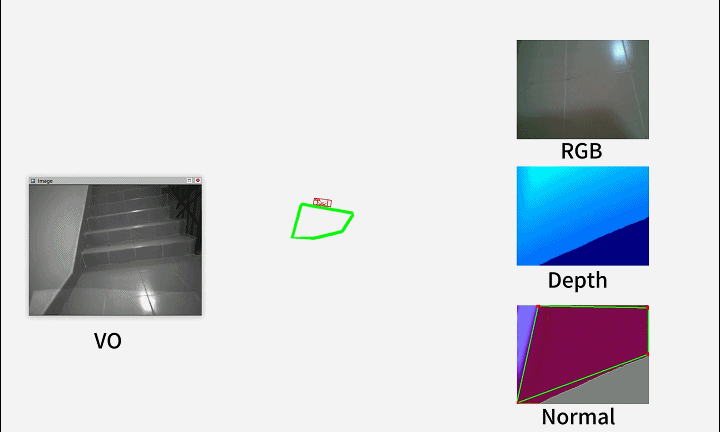

Real-time and efficient polygonal mapping designed for humanoid robots.

## Demo
### straight_stairs_mapping


### spiral_stairs_mapping


## Install

### Requirements
- Tested on `Ubuntu 20.04 / ROS Noetic`

### Dependencies
This package depends on
- pyrealsense2
- cupy
- ...

### Installation procedure
It is assumed that ROS is installed.

1. Clone to your catkin_ws
```bash
mkdir -p catkin_ws/src
cd catkin_ws/src
git clone https://github.com/BTFrontier/polygon_mapping.git

```

2. Install dependent packages.
 

3. Build a package.
```bash
cd catkin_ws
catkin build polygon_mapping
```

## Datasets
You can download the test dataset [here](https://1drv.ms/f/c/1e83680b5fbc1ae4/Et2MgY6eCHRMpczAZAwRXBUBvlHg70gRJopAoxf9fdi9vg?e=DQmDKZ).
Once downloaded, extract the `dataset_39` and `dataset_71` folders into the following directory:
```bash
catkin_ws/src/polygon_mapping/data
```
Now, you can run the test case with the following command:
```bash
rosrun polygon_mapping read_dataset.py
```
You can modify the dataset directory in `read_dataset.py` to use the dataset of your choice. During the testing process, intermediate images will be saved in the `processed` subdirectory within the dataset directory, allowing you to review the results later.

## Running on a Real Robot

In addition to the datasets, the system can be run on your own depth camera. By default, the code retrieves depth images from a RealSense camera. If you're using the L515, you can configure additional LiDAR parameters. If you're using another depth camera, you may need to modify the depth image input accordingly. Before running the mapping program, you can configure various parameters in the `config/config_param.yaml` file.

### External Odometry

First, ensure that the robot has an odometry system or another method for estimating its own state. Then, using the relative pose of the depth camera to the odometry, you need to send the depth camera's pose in the odometry coordinate frame via ROS tf in real-time. The configuration for the odometry frame and depth camera frame listener can be modified in the `config/config_param.yaml` file.

### Camera Parameters

This section includes parameters such as the serial number of the RealSense depth camera (important when using multiple cameras), depth image resolution, camera intrinsic parameters, etc. For the L515, adjusting several parameters can help improve the quality of the depth map.

### Algorithm Parameters

This includes image processing parameters and RANSAC parameters. These parameters influence the quality and real-time performance of the output and can be adjusted based on your needs.

### Running the Command

Once all parameters are configured, you can run the mapping program with the following command:

```bash
rosrun polygon_mapping main.py
```

## Citing

If you find this code useful in your research, please consider citing our paper:
[Real-Time Polygonal Semantic Mapping for Humanoid Robot Stair Climbing](https://arxiv.org/abs/2411.01919)

```bash
@misc{bin2024realtimepolygonalsemanticmapping,
      title={Real-Time Polygonal Semantic Mapping for Humanoid Robot Stair Climbing}, 
      author={Teng Bin,  Jianming Yao,  Tin Lun Lam and Tianwei Zhang},
      year={2024},
      eprint={2411.01919},
      archivePrefix={arXiv},
      primaryClass={cs.RO},
      url={https://arxiv.org/abs/2411.01919}, 
}
```
